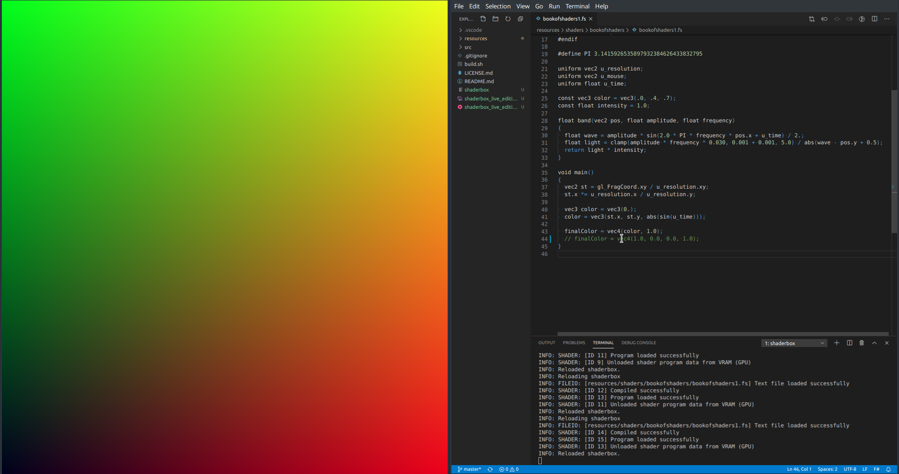

# shaderbox

A sandbox for testing and developing shaders.

Note that this is a side project I started for fun and it is a work in progress.

## Contributing

If you have any ideas, feel free to open an issue.
If you'd like to contribute, please fork the repository and make changes as
you'd like. Pull requests are warmly welcome.

## License

See [LICENSE](LICENSE.md) for details.
